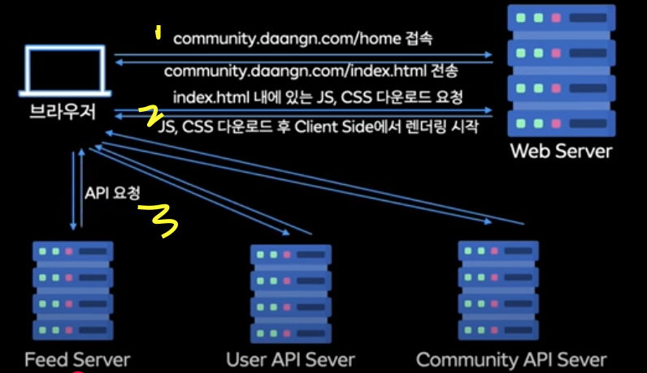

## SSR 기반 웹뷰 서비스 (in 당근마켓 동네생활)

> 25.02.26(수) 정진영  
> [아니, 여기도 웹뷰였어요? | 2024 당금 테크 밋업](https://www.youtube.com/watch?v=4UD4EB00AME&t=1553s)

### 당근마켓의 동네생활 서비스


1. 동네 기반의 커뮤니티 서비스
2. 동네 생활 외에도 모임, 맛집후기, 구청 소식 등의 정보를 공유할 수 있는 확장된 서비스
3. **웹뷰 기반 서비스**

### 네이티브 기반 ▶︎ 웹뷰 서비스 계기

1. 기존 네이티브 기반의 서비스
2. UI 개편, 서비스 확장 등 다양한 실험을 공격적으로 하고 싶다는 팀 내 니즈
3. 글조회/글쓰기 기능 부터 대체하기 시작

> 요구사항
>
> 많은 서비스가 웹뷰로 제공되기 위해선 **속도가 느리지 않아야 한다.**
>
> - CSR 기반의 React로 구현된 WebApp은 네이티브에 비해 특정 부분 속도 저하가 발생할 수 있다.

### CSR WebApp에서의 기존 문제 사항

1. CDN과 번들 문제

기존 체계 : vercel, cloudflare를 통해 배포하고 제공

- 배포 직후 번들을 새로 받아야 하고, `네트워크의 불안정`이나 `너무 큰 사이즈의 번들`일 경우 번들 다운로드가 끝날때까지 `화이트 스크린 출력` 발생

- cloudflare : CDN이 서울이 아닌 다른 지역을 거쳐서 올 경우 눈에 띄게 느렸다.

CDN 리젼 문제 : AWS를 이용하여 해결

- AWS cloudfront / s3 기반으로 배포되도록 빌드 파이프라인을 구축
- 일정 부분 해소는 가능

2. API 호출 문제

기존 CSR 방식 : 화면을 그리기 위한 모든 준비가 끝난 이후 브라우저에서 API 호출

- **번들 로딩이 끝나고 JS 로딩이 끝난 이후**에 API 호출이 실행되기 때문에 상대적으로 요청 시점이 느릴 수 있다.

- 사용자의 `네트워크` 상황에 따라 API 요청과 응답 자체가 느릴 수 있는 문제 발생

> **SSR** 도입 결정
> CSR 기반의 웹앱은 네이티브 대비 만족할만한 성능이 나오지 않음

### 직접 구축한 SSR WebApp 서비스

fastify + vite + React DOM Server 기반으로 직접 SSR을 처리하는 WebApp 구축

- next.js, remix를 쓰는 방법도 있지만, 사내에서 사용하는 도구들과 잘 맞지 않아 직접 구축하기로 결정

- API 요청을 브라우저에서 하지 않고, node.js 서버에서 호출하기 때문에 상대적으로 **사용자의 네트워크 환경에 영향을 덜 받는다.**
  
  

  - 기존 CSR 기반 서비스 : 브라우저에서 직접 API Server에 요청하는 **cross domain**
    - CORS 관련 preflight 요청 발생 -> 100~200ms 요청 발생
    - 다수의 요청을 보내기 때문에 무시할 수 없는 부분

- 서버에서 화면에 그려질 HTML을 미리 만들어서 내려주기 때문에 CSR 대비 화면이 빠르게 렌더링 되는 것 처럼 느껴질 수 있다.
  - CSR : 비어있는 div에 브라우저가 모두 준비가 끝난 후 렌더링, 로딩 중 표시 등의 UI를 통해 사용자에게 인식을 시킬 수 있다는 장점이 있음

### Streaming SSR

기존 SSR App의 단점 : API 호출 때문에 지연되는 부분이 발생하는 경우 사용자가 인지하지 못한다.

Streaming SSR : 화면을 한번에 그리지 않고 나누어서 그리는 방식으로 기존 SSR의 단점을 보완할 수 있다.

- API 호출과 관련없는 부분일 경우 가장 빠르게 그릴 수 있다.
- 외부 요소에 의해 렌더링이 지연될 수 있는 부분을 나중에 그린다.

```typescript
return new Promise((resolve, reject) => {
  const { pipe, abort } = ReactDOM.renderToPipeableStream(element, {
    onShellReady() {
      resolve(pipe(duplex));
    },
    onShellError(error: any) {
      abort();
      reject(error);
    },
    onError: (error: any) => {
      console.error(error);
    },
  });
});
```

```typescript
function ProfilePage(){
    return (
        <ProfileLayout>
        // 1. Shell 그려짐
        <Suspense fallback={<BigSpinner />}>
          <Sidebar>
            <Friends />
            <Photos />
          </Sidebar>
        // 2. Shell 그려짐
          <Suspense fallback={<PostsGlimmer />}>
            <Posts />
          </Suspense>
        </Suspense>>
        </ProfileLayout>

}
```

> 코드 설명
>
> 1. <Suspense> 밖에 있는 부분을 셸
> 2. 셸이 준비되면 onShellReady 콜백 실행 -> pipe 함수 호출을 통해 스트리밍 시작
> 3. 사용자에게 가장 먼저 셸이 보여지고, 이후 <Suspense> 경계로 나뉘어진 부분들이 스트리밍 되면서 렌더링 된다.


### 지속적인 유지 보수

웹뷰 전환 후 새로운 문제 발생

1.  iOS에서 키보드 활성화 시, focus 되는 요소가 화면 아래에 있다면 키보드 높이만큼 웹뷰를 위로 밀어버리는 현상
2.  fixed해도 밀려버리는 UI => 임시로 해결했지만 safari 업데이트로 언제든 변경될 수 있는 사항
3.  서버 모니터링 추가 작업 발생
    - node.js Server 로그 모니터링
    - 트래픽에 따른 Server 댓수 확인
    - 요청이 밀리고 있는지 확인
