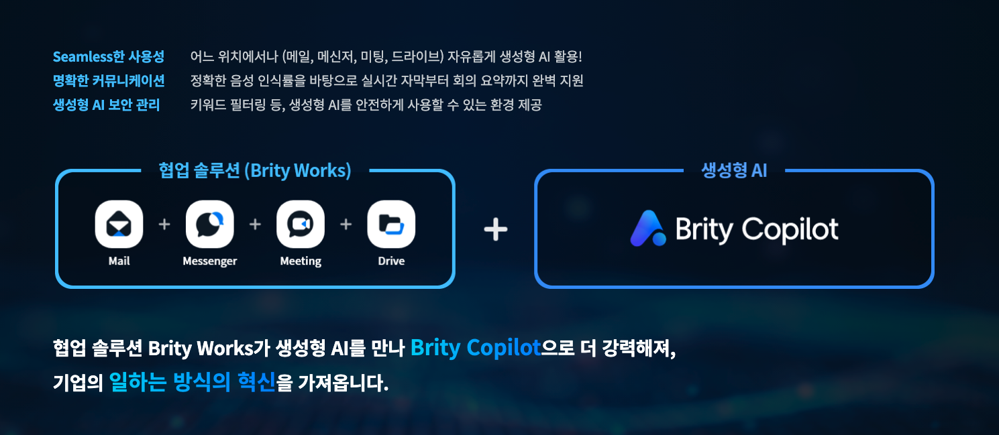
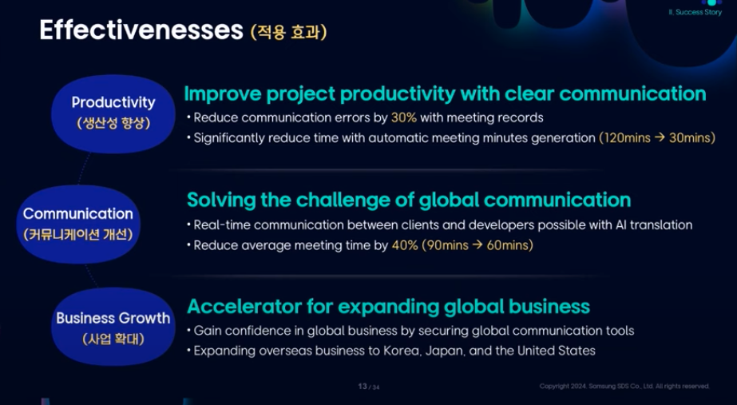
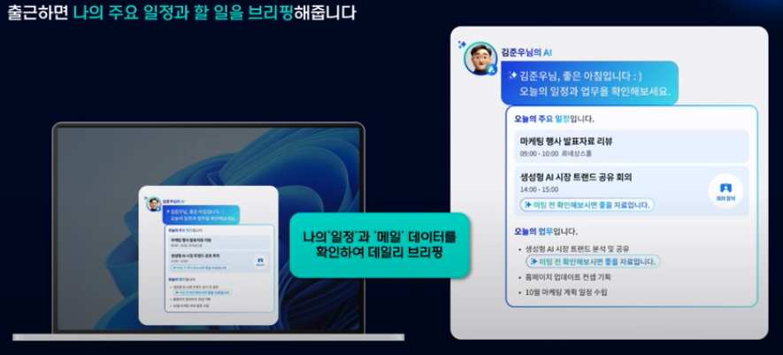
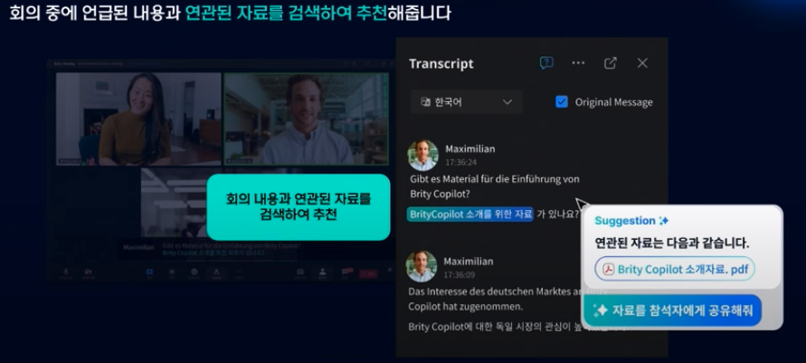
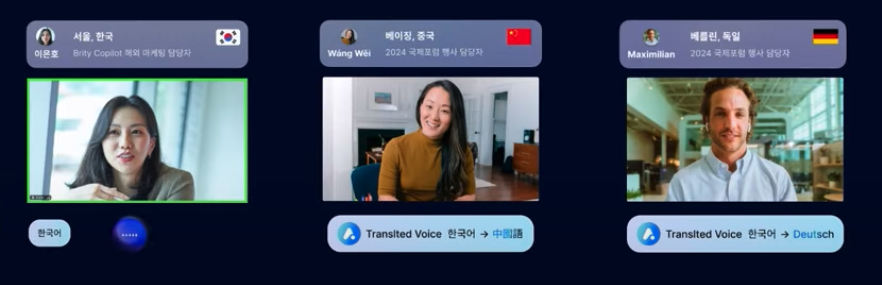

> 2025.03.25(wed)  
> [[REAL Summit 2024] 생성형AI 기반 협업의 현재와 미래 ㅣ CMC Global CTO Dang Van Tu, 삼성SDS 김준우 프로 ](https://www.youtube.com/watch?v=h5Ju_RSIMjw&list=PL5CBKg4LPW2cHLrtLraFvGc03A7O-QQCh&index=4)

## 1. 삼성 SDS의 Brity Copilot

> [**참고 영상**](https://www.youtube.com/watch?v=YWM4bdAdxks)

**생성형 AI 기술**을 협업 솔루션에 적용하여 기업의 일하는 방식을 새롭게 바꾸는 **기업 맞춤형 생성형 AI 서비스**

### 사용 효과

업무 일상에서 가장 비효율적인 부분 중 하나인 회의록 작성 (같은 말 반복, 서기 부재, 정확성 문제 등) 등을 지원하여 업무 속도가 빨라지고, 업무 효율이 높아진다.

디지털 전환의 흐름 속 IT 기업이 마주하는 큰 이슈는

1. IT Project Communitaion : 기업 내부의 의사 소통 이슈

   - 프로젝트 관리를 위한 빈번한 회의
   - 개인의 역할이나 배경 지식에 따라 내용을 다르게 이해
   - 회의록 작성에 많은 시간이 소요

2. Communication Quality with Global Customers
   - 고객과의 수시로 필요한 의사소통의 한계 : 통역가 의존
   - IT 비전문가의 통역으로 의사소통의 오류 발생
   - 프로젝트 인력 외 부수적인 비용과 관리 포인트 발생

 

## 2. Gen AI 서비스의 미래 : Autonomous Agent

> 미래의 생성형 AI는 사용자가 LLM에게 질문하거나 지시를 내리는 방식에서 벗어나,  
> **목표를 가지고 스스로 결정을 내리는 Autonomous Agent**와 상호작용하는 방식으로 진화할 것

### Personal Agent로서의 미래

1~3 단계를 계속 반복하며 **데이터**를 수집하고 방법과 순서를 계획하여 작업 수행

1. Perception (인지)
2. Reasoning & Planning (사유 & 계획)
3. Action (행동)

---

### 시나리오

1. 출근 : 나의 주요 일정과 해야할 일을 브리핑 해준다. (일정 데이터와 메일 데이터 분석)
2. 회의 : 미팅 어시스턴트

   

   - 회의 중에 언급된 내용과 연관된 자료를 검색하여 추천
   - 회의 중 공유한 문서나 자료를 자동으로 번역하여 제공

   

   - 회의 중 사용되는 다국어를 자막과 음성으로 실시간 번역
   - 회의 중 나온 내용을 분석하여 해야할 일과 일정 데이터에 추가

3. 이동 중 : 음성으로 업무 수행 가능

   - Agent가 메일을 읽어주고 음성으로 작업을 지시 (메일 요약, 발송 등)

4. 부재 중 업무 처리 : 부재 중이거나 집중 근무 중일 때 나를 대신하여 업무 요청에 대응 (자료 공유, 문의 답변)
