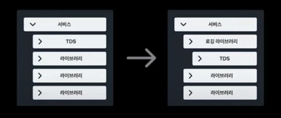
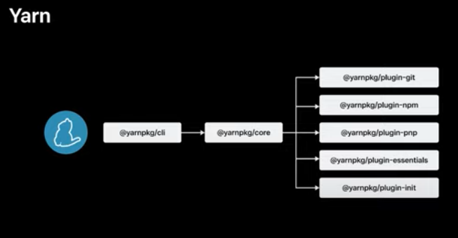

> **토스** : [Yarn Plugin으로 우아하게 자동 로깅하기](https://www.youtube.com/watch?v=E7jdKomaqjI)
> 설명
>
> 수많은 사용자와 서비스로부터 만들어지는 로그, 어떻게 관리하면 좋을까요?  
> Yarn을 활용하여 속도와 정확성, 개발자 경험까지 모두 잡은 방법을 소개합니다.

---

<br>
<br>

**소주제**

1. Yarn Plugin을 활용한 토스의 디자인 시스템
2. 로깅 시스템

## 토스에서는 로그를 많이 남기고 활용한다.

> **예시**
>
> - screen : 화면이 열렸다 -> 로그 기록
> - impression : 요소가 보여졌다 -> 로그 기록
> - click : 요소를 사용자가 클릭했다. -> 고르 기록

이렇게 상세하게 로그를 기록하여 비즈니스 로직을 세운다.

### 로그를 어떻게 활용할까

광고 노출 대비 클릭 분석

일간/ 월간 사용자 수 분석

A/B 테시트 결과 분석
에러 감지

CS 인입 시 원인 파악

...

목적

1. 디버깅 용이 : 에러가 어디서 발생했는지 찾을 수 있다.
2. 성능 분석 : API 요청이 느린지, 페이지 로딩 시간이 긴지 확인이 가능하다.
3. 사용자 경험 개선 : 사용자가 어떤 동작을 많이 하는지 파악하고 UI를 개선할 수 있다.

### 로그는 어떻게 만들어질까

각각의 서비스별, 서비스를 사용하는 기기별 등의 이유로 일괄적인 기준을 적용하기 어렵다.  
그래서 보통 각 서비스 담당 팀에서 자체적으로 기준을 정한 후, 로그를 정의하고 수집한다.

> **예시**
>
> 1. screen : `onStart`, `useEffect`
> 2. impression : `OnScrollListener`, `IntersectionObserver`
> 3. click : `OnClickListener`, `onClick

<br>

### 수동적으로 처리했을 때의 비효율적인 문제 발생

1. 로그 포맷을 사람이 직접 정의하고 있다.
2. 로그가 정상적으로 기록되어 있는지 검증도 수동으로 진행한다.

<hr>

서비스의 기능이 많아지고 복잡해지면서 개발 시간이 길어진다.

커뮤니케이션 과정에서 개발자와 데이터 분석가의 소통 오류가 발생했다.

### TDS로 해결을 시도

토스에서 사용되고 있는 통일된 디자인 시스템 라이브러리인 TDS.

TDS의 컴포넌트를 활용한다면 ?

1. 특정 UI에 대한 커뮤니케이션하기 때문에 소통의 오류가 발생하지 않는다.
2. 특정 플랫폼에 관계없이 표준화되어 있기 때문에, 로그의 일반적인 기준 정의 가 가능하다.

### `TDS 컴포넌트에 로그 시스템과 연계하면 되지 않을까?`

### **장점**

1. 개발 비용을 줄일 수 있다.
2. 기존 TDS 컴포넌트를 활용할 수 있기 때문에 기존 서비스 입장에서도 시간 비용 없이 새로운 로그 포맷을 적용할 수 있따.

### **단점**

1. 토스증권, 토스뱅크. 토스 페이먼츠 ... 많은 서비스에서 사용하고 있는 TDS.
2. TDS 코드와 로그 코드를 단순하게 통합하기엔 어려운 구조.
3. 토스 기타 협력사에 TDS를 전달할 경우 로그 로직 등이 유출될 수 있다.
4. TDS 버저닝과 로그 버저닝의 충돌이 발생할 수 있다
   - A 컴포넌트 추가(v.17.326.0) - B 컴포넌트 변경 (v.17.354.0) - A 컴포넌트 로그 변경(v.17.420.0)

### HOC 형태로 TDS+로그 감싸기

기존 컴포넌트

```javascript
const Button = ({ onClick, children }) => {
  return <button onClick={onClick}> {chidren} </button>;
};
```

[HO(cHigher-Order Component)](https://ko.legacy.reactjs.org/docs/higher-order-components.html)로 TDS 컴포넌트를 감싼 구조

```javascript
import { withLoggin } from "@tossteam/v3-logger";
import { Button as TDSButton } from "@toss/tds";

export * from "@toss/tds";
export const Button = withLogging(TdsButton, (props) => ({
  text: getTextContent(props.children),
}));
```

<br><br>

TDS와 로깅을 독립적으로 사용할 수 있게 되었지만,
`import {Button} from '@toss/tdx"` -> `import {Button} from @toss/logging-tds`로 변경된 코드를 수정해야 한다.

1. 많은 양의 코드 수정 발생
2. TDS 만 사용해야하는 컴포넌트인지, 로깅을 함께 사용해야 하는 컴포넌트인지 개별적으로 확인해야 하는 이슈 발생

```
기존과 똑같이 코드를 작성하면서,
TDS와 logging 간 독립적인 배포가 가능하도록
디자인 시스템 위에 로깅을 얹을 수 있을까?
```

### TDS 패키지를 가로채고, 로깅 라이브러리를 사용할 수 있게 한다.

기존 TDS 라이브러리를 사용하는 서비스 코드를 유지하면서,
HOC가 적용된 로깅 컴포넌트를 적용할 수 있게 된다.



`서비스 의존성 트리를 TDS 를 바라보는게 아니라 로깅 라이브러리를 바라보게 한다.`

기존 TDS를 사용하던 서비스는 기존 API 서비스 등 변경사항 없이 사용할 수 있게 된다.

HOC 기반 로깅 라이브러리를 제공할 수 있게 된다.

**서로 독립적으로 작용하면서도 기계적으로 확인해야 할 필요성이 없어짐**

<br>

### **Yarn berry**의 플러그인 기능을 활용하여 해당 구조를 가능하게 한다.



yarn은 package manage 전체가 여러 개의 플러그인으로 구성되어 있다.


yarn 설치 과정은 세 가지 스텝으로 이루어진다.

1. Resolution step
2. Fetch step
3. Link step

---

1. Resoultion step

어떤 패키지를 설치해야 하는지 결정하는 과정이다.

- package.json에 있는 의존성을 확인
- yarn.lock을 참고하여 정확한 버전 확인 (존재하지 않으면 새로 결정)
- 의존성 그래프를 만들어 패키지 간의 관계를 정리
- 서로 충돌하는 버전이 있을 경우 해결

2. Fetch step

패키지를 실제로 다운로드하는 과정이다.
yarn berry 버전을 사용할 경우 캐시(.yarn/cache/)를 확인하고 해당 패키지가 있다면 다운로드 없이 재사용이 가능하다.

- 필요한 패키지가 캐시에 있는지 확인
- 없으면 npm 레지스트리(또는 설정된 프라이빗 레지스트리)에서 다운로드
- .yarn/cache/에 패키지를 저장하여, 다음 설치 시 속도를 높임
- 이미 캐시에 있는 패키지는 다시 다운로드하지 않음 (오프라인 모드 지원)

3. Link Step

실제 패키지를 `node_modules/`에 배치하고, 프로젝트에서 사용할 수 있도록 만드는 과정이다.

---

**적용 방법**
Resolition step에서 TDS 패키지를 바로 찾는 것이 아니라, 로깅 패키지를 거치도록 하고
해당 패키지가 TDS 패키지를 의존성으로 가지도록 한다.
